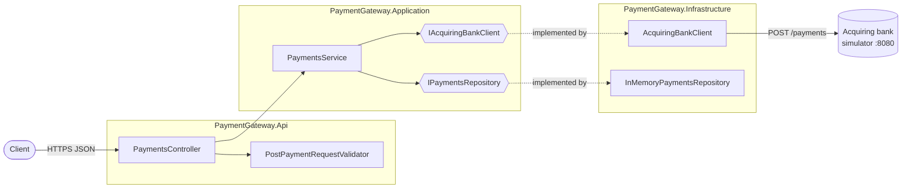

# Payment Gateway

A simplified card payment gateway built with ASP.NET Core 8. It validates a card payment, forwards it to an acquiring
bank for authorization, stores the outcome, and exposes that payment for later retrieval.

The acquiring bank is a [Mountebank](https://www.mbtest.org/) simulator running in Docker. The solution is split into
four projects — Domain, Application, Infrastructure and Api — so that dependency boundaries are enforced by the
compiler rather than by convention.

Full rationale for each decision lives in [DESIGN_DECISIONS.MD](DESIGN_DECISIONS.MD); this README gives an overview of the design.

## Contents

- [API](#api)
- [Architecture](#architecture)
- [Running it](#running-it)
- [Tests](#tests)
- [Known limitations and next steps](#known-limitations-and-next-steps)

## API

Two payment endpoints under `/api/Payments`. In Development, Swagger UI is served
at `/swagger`.

### `POST /api/Payments`

Processes a payment.

| Field | Type | Rules |
|---|---|---|
| `cardNumber` | string | Required, 14–19 characters, digits only |
| `expiryMonth` | int | Required, 1–12 |
| `expiryYear` | int | Required, 1–9999; together with the month, must be in the future |
| `currency` | string | Required, one of `GBP`, `USD`, `EUR` (case-insensitive) |
| `amount` | int | Required, greater than 0, in the **minor currency unit** (`1050` is £10.50) |
| `cvv` | string | Required, 3–4 characters, digits only |

```json
{
  "cardNumber": "2222405343248877",
  "expiryMonth": 4,
  "expiryYear": 2030,
  "currency": "GBP",
  "amount": 1050,
  "cvv": "123"
}
```

**`200 OK`** — the payment was processed and stored.

```json
{
  "id": "e0fff6ce-7f37-4552-a36f-b34c05db1ad1",
  "status": "Authorized",
  "cardNumberLastFour": "8877",
  "expiryMonth": 4,
  "expiryYear": 2030,
  "currency": "GBP",
  "amount": 1050
}
```

**`400 Bad Request`** — the request failed validation. Every broken rule is reported at once, and the bank is never
called. For a request with `"cardNumber": "1234"` and `"currency": "JPY"`:

```json
{
  "type": "https://tools.ietf.org/html/rfc9110#section-15.5.1",
  "title": "One or more validation errors occurred.",
  "status": 400,
  "errors": {
    "Currency": ["'Currency' must be a supported currency (GBP, USD, EUR)."],
    "CardNumber": ["'Card Number' must be between 14 and 19 characters."]
  },
  "traceId": "00-21949640bd7cb1a265ff80b48661efba-867ff9c55c79dca8-00"
}
```

**`422 Unprocessable Entity`** — the request was well-formed but the payment was rejected. Nothing is sent to the bank
and nothing is stored.

```json
{
  "type": "https://tools.ietf.org/html/rfc4918#section-11.2",
  "title": "Payment rejected",
  "status": 422,
  "detail": "Rejected: card has expired",
  "traceId": "00-f81ed458ee70c3f4efb0b7af23cd6991-197380173530510c-00"
}
```

### `GET /api/Payments/{id}`

Retrieves a previously processed payment. Returns `200 OK` with the same body shape as the POST response, or
`404 Not Found` (as `application/problem+json`) if no payment has that id. A non-GUID id fails the route constraint
and also returns `404`.

### Why these status codes

The mapping from outcome to status code is the least obvious part of the API, so to be explicit:

- **A declined payment is `200`, not an error.** The gateway did its job; the bank simply said no. The outcome is in
  the `status` field.
- **A bank *failure* is also `200` with `status: "Declined"`.** If the bank returns a 503, times out, or sends back
  something unparseable, there is no authorization decision — and without one, the payment cannot be treated as
  authorized. It is stored as declined and the underlying failure is logged at Warning, so outages stay visible
  without being surfaced to the caller as a 500.
- **An expired card is `422`, not `400`.** The request was structurally valid; it was the business rule that failed.
  Keeping it distinct from shape validation tells the caller that fixing the JSON won't help.

### Examples

With the stack running (see [Running it](#running-it)):

```bash
# Process a payment (card ends in 7 -> the simulator authorizes it)
curl -X POST http://localhost:8081/api/Payments \
  -H 'Content-Type: application/json' \
  -d '{"cardNumber":"2222405343248877","expiryMonth":4,"expiryYear":2030,"currency":"GBP","amount":1050,"cvv":"123"}'

# Retrieve it
curl http://localhost:8081/api/Payments/{id}
```

Those URLs assume the Docker setup. Running the API from source instead, the base URL is `https://localhost:7092`,
and `curl` needs `-k` to skip verification of the ASP.NET development certificate — requests to
`http://localhost:5067` are `307`-redirected to HTTPS by `UseHttpsRedirection`.

## Architecture

```
src/
  PaymentGateway.Domain           Entities and enums. No dependencies at all.
  PaymentGateway.Application      Business rules, orchestration, and the interfaces
                                  Infrastructure implements.
  PaymentGateway.Infrastructure   Acquiring bank HTTP client, in-memory repository.
  PaymentGateway.Api              Controllers, DTOs, validators, DI wiring.
                                  The only executable project.
test/
  PaymentGateway.Api.Tests
  PaymentGateway.Application.Tests
  PaymentGateway.Infrastructure.Tests
  PaymentGateway.IntegrationTests
imposters/                        Bank simulator configuration (provided; unmodified).
Dockerfile                        Multi-stage build for the API image.
docker-compose.yml                Runs the API and the bank simulator together.
```



### Design 

Summarised from [DESIGN_DECISIONS.MD](DESIGN_DECISIONS.MD), which has the full reasoning:

- **Four projects, not one.** Splitting into layers makes the dependency rules compiler-enforced — `Domain` genuinely
  cannot reference `Infrastructure`. A single project with folders would have been an equally legitimate and simpler
  choice; this trades a little ceremony for boundaries that can't quietly erode.
- **Application owns its interfaces.** `IAcquiringBankClient` and `IPaymentsRepository` are declared where they're
  consumed, not where they're implemented, so orchestration can be unit tested without HTTP or a data store.
- **Validation happens in two places, deliberately.** FluentValidation handles request *shape* (lengths, ranges,
  supported currencies) — pure structural checks with no external state. `PaymentsService` handles *business rules*
  that need external state, namely whether the card has expired, which requires a clock. The clock is injected as
  `TimeProvider`, so expiry-boundary behaviour is testable without waiting for real time to pass.
- **The bank client hides HTTP from its callers.** A `503` becomes `AcquiringBankUnavailableException`; every other
  failure — unexpected status, network error, timeout, malformed or empty body — becomes the base
  `AcquiringBankException`. Callers never see `HttpResponseMessage`. Cancellation requested by the caller propagates
  unwrapped as `OperationCanceledException`, so a client disconnect isn't misread as a bank failure.
- **The repository is a `ConcurrentDictionary`.** It's registered as a singleton, so concurrent requests hit it
  simultaneously; the `List<T>` it replaced could lose writes. Keying by id also makes lookups O(1) instead of a scan.
- **The repository interface is async** even though the in-memory implementation completes synchronously, so swapping
  in a real database later doesn't ripple signature changes up through the service and controller.
- **Serilog** gives one structured request-completion event per request, a JSON console sink an aggregator can
  ingest as-is, and a rolling daily file sink for when there's no aggregator to ingest it. Only Api depends on
  Serilog; Application and Infrastructure log through `ILogger<T>`, keeping the provider a composition-root
  decision.

## Running it

Requires [Docker](https://docs.docker.com/get-docker/), plus the
[.NET 8 SDK](https://dotnet.microsoft.com/download/dotnet/8.0) if you want to run the API from source.

### Option A — everything in Docker

```bash
docker compose up --build
```

| | URL |
|---|---|
| API | http://localhost:8081/api/Payments |
| Swagger UI | http://localhost:8081/swagger |
| Bank simulator | http://localhost:8080 (Mountebank admin on :2525) |

The API container reaches the simulator over the compose network via
`AcquiringBank__BaseUrl=http://bank_simulator:8080/`, and runs with `ASPNETCORE_ENVIRONMENT=Development` so Swagger
UI is served from inside the container too. Host port 8081 is used because the simulator already holds 8080.

Stop with `docker compose down`.

### Option B — API from source, simulator in Docker

```bash
docker compose up -d bank_simulator
dotnet run --project src/PaymentGateway.Api
```

The API then listens on `https://localhost:7092` and `http://localhost:5067`, with Swagger UI at `/swagger`. In this
mode the simulator's base URL comes from `AcquiringBank:BaseUrl` in `appsettings.json` (`http://localhost:8080/` —
the trailing slash matters, since the client posts to the relative path `payments`).

### Logs

Both modes write a structured event per request to the console. Docker additionally writes rolling daily files to
`./logs/` in the repo root, bind-mounted from `/app/logs` in the container and created on first run.

## Tests

```bash
dotnet test
```

Currently 132 tests across four projects.

### What's tested where

| Project | Tests | What it covers                                                                                                                                                                                                            | Collaborators faked with |
|---|---|---------------------------------------------------------------------------------------------------------------------------------------------------------------------------------------------------------------------------|---|
| `PaymentGateway.Api.Tests` | 59 | Controller mapping, status code selection, and validation-failure logging; every validator rule, including rejection of non-ASCII digits and case-insensitive currency matching                                           | Moq, `FakeLogger<T>` |
| `PaymentGateway.Application.Tests` | 15 | `PaymentsService`: bank outcome to stored status, bank failure to `Declined`, expiry boundaries, currency normalisation, last-four masking, cancellation                                                                  | Moq, including `Mock<TimeProvider>` for a pinned clock |
| `PaymentGateway.Infrastructure.Tests` | 32 | `AcquiringBankClient`'s snake_case wire contract, `MM/yyyy` expiry formatting, and every failure-to-exception mapping; repository round-trips                                                                             | A hand-written `StubHttpMessageHandler` behind a real `HttpClient` |
| `PaymentGateway.IntegrationTests` | 26 | Both endpoints end-to-end over real HTTP through the real DI container: JSON shape, `problem+json` bodies, POST-then-GET round-trip, model-binding failures, Swagger generation, Serilog request logging | The outbound `HttpMessageHandler` replaced in the container |

The tooling is xUnit v3 throughout, with Moq for mocking, `FakeLogger<T>` from
`Microsoft.Extensions.Diagnostics.Testing` for asserting on log output, and FluentValidation's own `TestHelper` for
the validator rules. HTTP is faked with hand-written stubs for simplicity at this scale.

### Tests that encode decisions

Most of the suite is unremarkable, but three cases exist to pin down decisions rather than mechanics:

- `ProcessPaymentAsync_DoesNotLogCardNumberOrCvv` — scans all log output for the PAN and CVV, so the "never logged"
  guarantee fails loudly if someone adds a convenient debug line.
- The `"0012"` last-four cases, at both service and integration level — these fail if `CardNumberLastFour` is ever
  changed back to an integer.
- `ProcessesPaymentIfCardExpiresInDecemberOfMaxYear` — a 12/9999 card, guarding the expiry comparison against
  date-construction overflow.

## Known limitations and next steps

These are scope decisions for the exercise rather than oversights, but each would need addressing for production:

- **Payments are stored in memory** and are lost on restart. `IPaymentsRepository` is the swap point; a
  database-backed implementation would need no changes above it.
- **No idempotency.** Every POST mints a new `Guid`, so a client that retries after a timeout is charged twice. The
  simulator has no idempotency-key support, so there was nothing to integrate against — in production this is the
  first thing to add, most likely a client-supplied key passed through to the bank.
- **No retries.** Transient bank failures would normally warrant backoff via something like Polly, but the
  simulator's 503 is deterministic per card number rather than transient, so a retry would return the same answer.
  Retrying a payment safely also depends on idempotency, so the two go together.
- **No authentication or rate limiting.** `UseAuthorization()` is in the pipeline but nothing is registered behind
  it. A real gateway would authenticate the merchant and throttle per-merchant.
